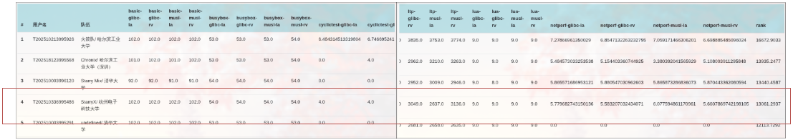

#  StarryX

A monolithic kernel based on arceos/starry.

First prize in CSCC OS Competition 2025.

## 📦 项目结构

<div style="text-align: center;">
  
</div>

```shell
.
├── rust-toolchain.toml      // Toolchain configuration
├── configs                  // Build configs and platform presets
├── docs                     // Documentations
├── Makefile                 // Build scripts
├── Cargo.toml               // Rust workspace configuration and dependencies
├── scripts                  // Build and QEMU helper scripts
├── tools                    // Board packaging helper assets
├── arceos					 // Vendored ArceOS component crates/workspace
├── src                      // Entry OS
├── xapi					 // Posix API
├── xcore					 // OS Core
├── xmodules                 // Monolithic modules 
└── xtest					 // Linux APP for tets
```

## 🛠️ 构建方式

构建全国大学生操作系统内核赛测例 (riscv / loongarch)

```shell
make all
```

## 🚀 运行方式

运行全国大学生操作系统内核赛测例 (riscv / loongarch)

```shell
make rv
make la
```

移植到visionfive2板卡

```shell
make vf2
```

## ✨ 项目说明

StarryX操作系统是基于组件化操作系统ArceOS的宏内核扩展实现，完整实现了进程管理，内存管理，文件系统，信号系统等模块。当前仓库根层构建系统只保留 `riscv64`、`loongarch64` 的 QEMU 目标，以及 `riscv64-visionfive2` 板级打包路径。[学习/开发日志](./docs/record.md);[决赛文档](./docs/StarryX.pdf);[决赛PPT](./docs/StarryX.pptx)

截至目前，StarryX共实现约200项系统调用，包括进程管理、文件系统、内存管理、网络等各个模块的系统调用，能够运行官方测试中的大量LTP测例以及LTP外的所有测例，并能够运行Redis、Git、Gcc等Linux应用。

<div style="text-align: center;">
  
</div>

StarryX的各个子模块实现均较为完善，完成情况如下：

| 子模块   | 完成情况                                                     |
| -------- | ------------------------------------------------------------ |
| 文件系统 | 类Linux 的 VFS设计 <br>丰富的抽象文件支持和完善的伪文件系统实现<br>支持EXT4与FAT文件系统<br>模块解耦的页缓存设计 |
| 内存管理 | 懒分配、写时复制<br>模块解耦的用户空间访问<br>模块解耦的文件映射管理 |
| 进程管理 | 多核场景下的负载均衡<br>多种调度方式支持<br>完整实现的System V进程通信<br>模块解耦的进程管理 |
| 网络模块 | 支持TCP和UDP套接字<br>实现端口复用                           |
| 信号系统 | 模块解耦的信号系统<br>可被信号中断的系统调用                 |


### References

base：[oscomp/starry-next](https://github.com/oscomp/starry-next/tree/0c84473be8a7e3876c62d69f63c2853f404df3a9);[oscomp/arceos](https://github.com/oscomp/arceos/tree/dec6f341785079143dcd55f48e0b8764ead3029f)

fs：[axfs_ng](https://github.com/Mivik/arceos/tree/fs/modules/axfs-ng)
