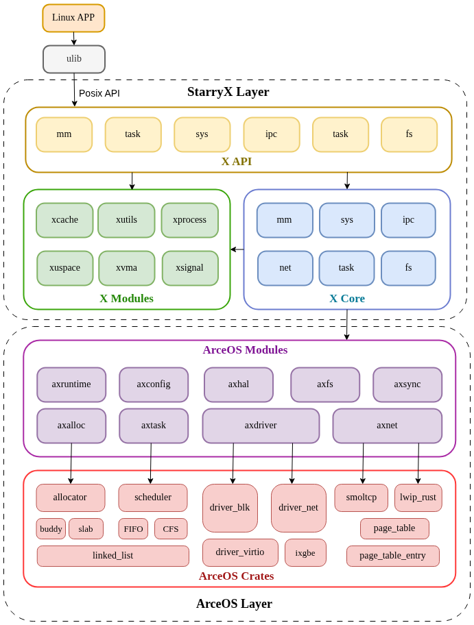

#  StarryX

A monolithic kernel based on arceos/starry.

## 📦 项目结构

<div style="text-align: center;">
  
</div>

```shell
.
├── README.md
├── rust-toolchain.toml
├── docs
├── Makefile
├── Cargo.toml
├── arceos					 // base OS
├── modules                  // monolithic modules 
├── src                      // entry OS
├── xapi					 // Posix API
├── xcore					 // OS Core
└── xtest					 // Linux APP for tets
```

## 🛠️ 构建方式

构建全国大学生操作系统内核赛测例 (riscv / loongarch)

```shell
make all
```

## 🚀 运行方式

运行全国大学生操作系统内核赛测例 (riscv / loongarch)

```shell
make rv
make la
```

## ✨ 项目说明

**StarryX **是基于组件化操作系统 **ArceOS** 的宏内核扩展实现，完整实现了进程管理，文件系统，信号系统等功能，并通过硬件抽象层axhal能够运行在四个架构上（riscv64 / loongarch64 / x86_64 / aarch64）,截止目前我们实现了约150条系统调用，成功运行了初赛的全部测例（除去部分LTP测例），我们完整撰写了文档和PPT，在开发过程中我们始终践行组件化内核的开发理念与原则，将内核模块抽象为独立组件并集成测试，并详细记录了我们参加开源操作系统训练营、学习和开发ArceOS/SrarryX的过程。

||  [学习/开发日志](./docs/record.md) || [Github代码仓库](https://github.com/Anekoique/StarryX) ||

|| [初赛文档](./docs/StarryX.pdf) || [初赛PPT](./docs/StarryX.pptx) || [初赛视频](https://pan.baidu.com/s/1x0gMF_K7H1GuciTz_kKf5g?pwd=ftns) 提取码：ftns ||

|| [决赛文档]() || [决赛PPT]() || [决赛视频]() 提取码: abcd ||


### Reference

StarryX的基座代码为ArceOS和Starry-next，并在后续开发过程中合并了大部分主线进展，其中ArceOS的文件系统修改使用了清华大学开发的axfs-ng

基座仓库：

|| [oscomp/starry-next](https://github.com/oscomp/starry-next/tree/0c84473be8a7e3876c62d69f63c2853f404df3a9) commit: 0c8447c || [oscomp/arceos](https://github.com/oscomp/arceos/tree/dec6f341785079143dcd55f48e0b8764ead3029f) commit: d1f0c64 || [axfs_ng](https://github.com/Mivik/arceos/tree/fs/modules/axfs-ng) branch: fs ||

系统调用实现参考：

|| [learningos](https://learningos.cn/oscomptest-grading/) || [asterinas](https://github.com/asterinas/asterinas/tree/main) || [byteos](https://github.com/oscomp/ByteOS) ||
