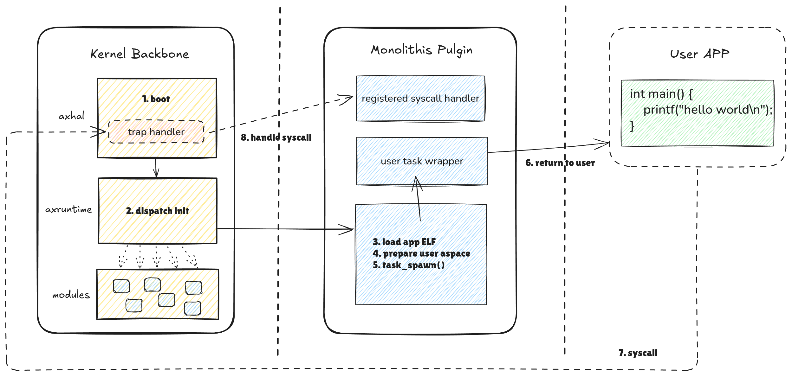

# 启动与初始化

StarryX的启动流程涉及从ArceOS Layer到StarryX Layer再到用户程序，本部分将详细解释StarryX的启动与初始化过程，层次清晰地展现StarryX如何利用ArceOS的内核基础功能、扩展宏内核功能、服务用户程序。



## 硬件初始化

axhal模块抽象了底层硬件与平台，StarryX从链接脚本的特定位置启动，跳转到特定arch的_start函数完成CPU与mmu初始化后跳转到硬件平台的rust_entry，完成对硬件中断、时钟、串口等的硬件初始化后跳转到axruntime模块进行组件初始化：

```rust
// riscv qemu
extern "C" fn _start() -> ! {
    1. save hartid
    2. save DTB pointer
    3. setup boot stack
    4. setup boot page table and enabel MMU
    5. call rust_entry(hartid, dtb)
}

extern "C" fn rust_entry(cpu_id: usize, dtb: usize) {
    1. clear .bss
    2. init CPU set stdev
    3. init timer / console
	4. call rust_main(hartid, dtb)
}
```

## 组件初始化

axruntime模块确保内核运行环境就绪并为宏内核扩展提供支撑，完成了kernel backbone的初始化过程。其启动流程包括以下步骤：

```rust
pub extern "C" fn rust_main(cpu_id: usize, dtb: usize) {
    axlog::init();     		    // 日志系统初始化
    init_allocator();  		    // 内存分配器初始化
    axmm::init();      		    // 虚拟内存管理初始化
    axtask::init_scheduler();   // 多任务调度器初始化
    axdriver::init();           // 驱动初始化
    asfs::new_root();           // 文件系统初始化
    asnet::init();              // 网络初始化
    mp::start();                // 多核初始化
    main()
}
```

完成kernel backbone的初始化流程后将进入内核扩展的初始化阶段，对于单内核来说，用户APP将接管main函数的运行，对于宏内核来说，StarryX的main函数将接管main函数的运行，并完成宏内核的初始化。

## 宏内核初始化

StarryX的main函数接管内核运行后将对各个子模块完成初始化，之后开始运行用户程序

```rust
fn main() {
    xprocess::new_init();       	// 创建初始化进程
    xcore::fs::vfs::init_root();	// 初始化伪文件系统
    xcore::fs::fd::init_stdio();    // 初始化FD表
    run_user_app()					// 运行用户程序                    
}
```

对于运行的单个程序，StarryX通过run_user_task构造可运行的task，并调度运行，其主要经历以下几个过程：

1. 构建用户空间 , 映射内核区域
2. 加载并映射用户程序的 `ELF` 文件，返回入口地址。
3. 构造上下文并模拟返回
4. 初始化命名空间资源
5. 创建新进程
6. 为新进程创建线程
7. 等待进程运行结束并返回退出码

经过一系列初始化过程后，用户程序就成功在StarryX上运行起来。
