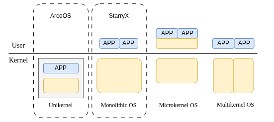

# 概述

## 系统简介

​	StarryX操作系统是基于组件化操作系统ArceOS的宏内核扩展实现，完整实现了进程管理，内存管理，文件系统，信号系统等模块，通过硬件抽象层axhal能够运行在四个架构上（riscv64 / loongarch64 / x86_64 / aarch64），并成功移植到riscv visionfive和loongarch 2K1000硬件平台。

​	ArceOS 采用模块化设计，将操作系统功能拆分为可重用的组件，允许开发者根据特定场景需求灵活组合功能模块。StarryX的设计理念是将 ArceOS 单内核(Unikernel)的组件化优势与宏内核的高性能特性相结合，通过在 ArceOS 的单内核架构上扩展实现宏内核的任务管理、内存管理等核心功能，构建一个高效、灵活且支持 Linux 应用兼容的组件化宏内核操作系统。 StarryX的设计理念基于以下核心原则：

1. 强调组件化与模块化，通过将任务管理、内存管理等功能封装为独立组件，降低模块间耦合度，提升系统的可维护性和可扩展性；
2. 注重性能优化，保留宏内核在系统调用和资源管理方面的高效性，同时通过 ArceOS 的组件化框架减少不必要的抽象开销；
3. 追求场景适配性，支持用户根据物联网、云计算或嵌入式设备等不同场景需求，灵活定制内核功能。通过以 ArceOS 为基座，StarryX旨在为开发者提供一个高效、安全、可定制的宏内核操作系统平台，满足多样化场景下对性能、灵活性和兼容性的需求。

## 系统架构

  

StarrX的系统架构主要分为两层：

1. 底层为ArceOS Layer，ArceOS的核心功能主要由各个模块构成，包括 axruntime、axconfig、axalloc、axfs、 axsync、axtask、axdriver、axnet 等，这些模块由与具体操作系统无关的基础组件构成；ArceOS layer为StarryX提供了内核的基础功能；
2. 上层为StarryX Layer，StarryX在ArceOS提供的内核基础服务上扩展宏内核相关功能，其主要由三个模块X Core、X Modules和X API构成，其中X Modules是实现了宏内核功能的可供复用的基础组件、X Core实现了宏内核基础功能、X API通过X Core和X Modules提供的服务实现了标准POSIX接口。

对于StarryX layer，X Core是实现宏内核功能的核心，主要实现了宏内核的进程管理、文件系统、内存管理、系统管理、进程通信和网络模块。

## 系统完成情况

​	截至目前，StarryX共实现约200项系统调用，包括进程管理、文件系统、内存管理、网络等各个模块的系统调用，能够运行官方测试中的大量LTP测例以及LTP外的所有测例，并能够运行Redis、Git、Bash等Linux应用。

​	StarryX的各个子模块实现均较为完善，完成情况如下：

| 子模块   | 完成情况           |
| -------- | --------------------- |
| 文件系统 | 类Linux 的 VFS设计  丰富的抽象文件支持和完善的伪文件系统实现 支持EXT4与FAT文件系统 模块解耦的页缓存设计 |
| 内存管理 | 懒分配、写时复制 模块解耦的用户空间访问 模块解耦的文件映射管理 |
| 进程管理 | 多核场景下的负载均衡 多种调度方式支持 完整实现的System V进程通信 模块解耦的进程管理 |
| 网络模块 | 支持TCP和UDP套接字 实现端口复用 |
| 信号系统 | 模块解耦的信号系统 可被信号中断的系统调用 |

