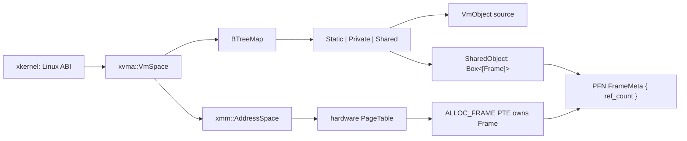

# 内存管理



## 整体架构

StarryX 将进程虚拟内存拆分为物理帧、硬件地址空间与安全策略三部分。`xalloc` 提供底层物理页和内核堆分配；`xmm::AddressSpace` 封装受信任的页表、PTE 和 TLB 操作；安全组件 `xvma::VmSpace` 则是进程 VMA 布局、映射属性和文件后端的唯一所有者。`xkernel` 仅完成 Linux syscall、文件对象和信号语义的适配，不再维护第二张文件 VMA 表。

## 内存分配

内存分配的主要逻辑在xalloc模块中实现，其核心为`GlobalAllocator`结构体：

```rust
pub struct GlobalAllocator {
    balloc: SpinNoIrq<DefaultByteAllocator>,
    palloc: SpinNoIrq<BitmapPageAllocator<PAGE_SIZE>>,
}
```

GlobalAllocator由两部分组成，palloc使用位图分配器管理物理页的分配，而balloc提供了字节范围的分配接口，当用户申请内存分配时，先分配balloc分配器的内存，若balloc分配器内存不足，则从palloc分配器分配内存。其中balloc实现了多种内存分配算法，包括Buddy、Slab和Tlsf，可以通过feature自由选择：

```rust
cfg_if::cfg_if! {
    if #[cfg(feature = "slab")] {
        /// The default byte allocator.
        pub type DefaultByteAllocator = allocator::SlabByteAllocator;
    } else if #[cfg(feature = "buddy")] {
        /// The default byte allocator.
        pub type DefaultByteAllocator = allocator::BuddyByteAllocator;
    } else if #[cfg(feature = "tlsf")] {
        /// The default byte allocator.
        pub type DefaultByteAllocator = allocator::TlsfByteAllocator;
    }
}
```

xalloc为内核提供内存分配的接口的同时，StarryX为该模块新添加了内存回收接口，通过使用crate_interface组件解决循环依赖问题，当内核内存不足时，可以回收别的内核功能实现的内存，比如页缓存：

```rust
#[crate_interface::def_interface]
pub trait XAllocIf {
    fn evict_cache(num_pages: usize) -> AllocResult;
}

```

## 地址空间管理

每个进程只持有一个 `xvma::VmSpace`。它以按起始地址排序的 `BTreeMap` 管理完整 VMA 元数据，并私有持有一个 `xmm::AddressSpace` 作为硬件地址空间：

```rust
pub struct VmSpace {
    range: VirtAddrRange,
    areas: BTreeMap<VirtAddr, VmArea>,
    address_space: xmm::AddressSpace,
}
```

`VmArea` 不再按 syscall 来源堆叠 backing 类型，而是按生命周期和 fork 语义
归纳为三类：`Static` 表示内核全生命周期有效的物理帧区间；`Private` 表示需要按需建立
私有页并参与 COW 的映射；`Shared` 表示由稳定共享对象持有的页集合。匿名零页
和私有文件页都是 `Private`，区别仅在于后者带有 `VmObject` source。`map`、
`unmap`、`mprotect`、缺页和 `fork` 都先经过这一所有者；区域切分和合并也只
在这里发生。文件 source 通过不依赖 `xfs`/`xkernel` 的 `VmObject` 接口读取，
后续页缓存可以实现同一接口。

```rust
pub trait VmObject: Send + Sync {
    fn read_at(&self, buf: &mut [u8], offset: u64) -> LinuxResult<usize>;
    fn byte_len(&self) -> LinuxResult<u64>;
}
```

`xmm::AddressSpace` 不再保存区域、backing 模型或普通驻留页的逐页索引。物理帧模型
只保留三个有独立职责的数据结构：

```rust
pub struct Frame {
    paddr: PhysAddr,
}

struct FrameMeta {
    ref_count: AtomicU32,
}

pub struct StaticFrameRange {
    start: PhysAddr,
    size: usize,
    allowed_flags: MappingFlags,
}
```

`Frame` 是 allocator-backed 4 KiB 物理帧的唯一公开 RAII 句柄。clone 增加
引用计数，drop 减少引用计数，最后一个引用负责把物理帧归还 `xalloc`。旧设计
中的 `Page` 只表示“尚未发布的唯一页”，`PageRef` 表示“可共享的页引用”；两者
物理表示相同，区别只在能否写入。现在新分配的 `Frame` 从计数一开始，
`try_write_at` 仅在计数仍为一时写入，因此不再需要两个公开类型和 `into_ref()`
转换。

`FrameMeta` 不是另一种 Frame，而是类似 `ArcInner` 的私有控制块。硬件 PTE
只能保存物理地址，解除映射时必须用 PFN 找回引用计数；因此它不能与句柄合并，
也不能直接用一个无法从 `PhysAddr` 恢复的普通 `Arc` 替代。它只保存
`ref_count`，不承载 VMA、共享内存或页缓存策略。

旧 `ManagedPage` 只是 `address + PageRef + flags + page_size` 的查询 DTO，没有
独立生命周期语义，现已删除。COW 单页查询通过 `frame_if_shared` 完成：PTE
独占时返回 `None`，只有确实共享时才克隆并返回 `Frame`；稀疏批量查询
`mapped_frames` 返回 `(VirtAddr, Frame, MappingFlags)`。allocator-backed 用户帧
当前固定为 4 KiB，因此查询结果不重复保存页大小。`Frame` 的分配 API 和
`SharedObject` 同样不再重复接收或保存恒定的 page size；只有支持多级页表粒度的
Static mapping 显式携带 `PageSize`。

`StaticFrameRange` 则是静态物理帧范围的生命周期与权限证明，不拥有引用计数。
它必须独立存在，因为内核映像、MMIO 和 vDSO 不能由 `Frame::drop` 释放。

PTE 的释放策略由一个内部枚举统一表达：

```rust
enum FrameKind {
    Alloc,  // PTE owns one Frame reference
    Static, // lifetime is guaranteed by StaticFrameRange
}
```

`Alloc` leaf 在架构 PTE 的软件位记录 `ALLOC_FRAME`；`Static` leaf 不设置该位。
unmap、COW 和帧查询必须验证这一标记，不能仅凭 PFN 当前存在有效引用推断 PTE
拥有一个 `Frame`。

```rust
pub struct AddressSpace {
    range: VirtAddrRange,
    page_table: PageTable,
}

struct FrameMeta {
    ref_count: AtomicU32,
}
```

页表是 resident mapping 的唯一事实来源。`AddressSpace::drop` 直接遍历 PTE，
确认所有 `Alloc` mapping 都已经通过正常 unmap 路径释放，不再维护可从
`ALLOC_FRAME` leaf 推导出的聚合计数。普通权限页和 `PROT_NONE` 驻留页都只保存在
页表中，不存在按虚拟地址索引的第二套 resident map。
unmap 先无分配遍历 PTE 完成 kind、页大小和 Frame owner 预检，再按页表粒度原地
移除 leaf；`VmSpace::drop` 因此不需要为 resident pages 构造临时向量。

`xmm` 只提供基于 `StaticFrameRange` proof token 的
`map_static_range`、`map_frame`、`replace_frame`、`unmap_*_range`、通用
`ProtectionTransaction`、单次 resident-flags 查询和查询/复制机制。
匿名、文件、共享、COW 与 fork 的选择全部在 `xvma`。

安全字节复制同样属于 ownership 边界：`VmSpace::read_bytes/write_bytes`
先检查 authoritative VMA 权限；底层 `AddressSpace::read_bytes` 再逐 PTE
检查 READ 并拒绝设备内存，`write_alloc_bytes` 则逐 PTE 要求 WRITE 和
`FrameKind::Alloc`。因此只读 `StaticFrameRange`（如 vDSO）不能通过安全内核
API 被改写。ELF 与共享文件 snapshot 在地址空间尚未对用户可见时临时增加
Alloc 映射的 WRITE 权限，填充后立即恢复最终权限。

`PROT_NONE` 不会被编码成“有效但没有 R/W/X”的硬件 leaf。每种架构只增加一个
软件保留位：清除硬件 valid/present 位与访问位，同时保留可恢复的物理地址、
`ALLOC_FRAME` 和页大小信息；其中 x86 为避免 non-present PTE 暴露真实 PFN，会在 PTE 内反转地址位，
并在软件查询时还原。`GenericPTE::is_present` 表示逻辑 resident，因此 query、稀疏遍历、
fork 和 unmap 仍沿用一条页表路径；处理器则把该 PTE 视为不可访问并正常触发缺页。
恢复权限只是原地更新 PTE flags，不需要 clone Frame、重建页表或维护旁路容器。

`VmSpace::protect` 对整个 syscall 范围是事务式的，而不是逐 VMA 尽力修改。
它先构造切分、合并后的 VMA tree；`ProtectionTransaction` 先用 authoritative
leaf walk 完成 kind/page-size/Frame owner 预检并统计 resident leaf，再预留
journal 容量。第二次 walk 同时记录 address、old flags 和已经计算好的 new
flags，随后直接 apply，不再调用普通 protect 路径重复 preflight。只有全部
backing 更新成功后才提交 VMA flags。若后续范围失败，事务按逆序执行不分配
内存的 PTE restore，因此 authoritative VMA 与页表状态不会分叉。`PROT_NONE`
的 PFN 和 owner 从未离开 PTE，回滚不涉及 Frame 转移或页表重建。

裸静态物理范围只能通过 `unsafe StaticFrameRange::new` 建立，调用者必须
证明 kernel-long lifetime 与允许的访问/alias 契约；普通安全代码不能把
allocator-backed `Frame` 伪装成 `Static` PTE。用户页表导入也不接受任意 source，
只能调用 `copy_kernel_mappings` 借用永不析构的全局 kernel hierarchy，并在
导入前拒绝任何 `ALLOC_FRAME` leaf。

对于页对齐的 `'static + Sync` 对象，`StaticFrameRange::from_static_readonly`
安全地产生只读 proof；不可变静态字节可以通过 `from_static_code` 产生
READ/EXECUTE proof。vDSO 因此只需公开 image 与 opaque vvar 静态引用，不需要
依赖 `xmm`，proof 构造和用户权限选择由 `xkernel::vdso` 适配层完成。

页元数据在页分配器初始化前占用最大空闲内存区域的一段连续前缀，因此地址
永久稳定，也不需要为每个页额外进行堆分配。fork 枚举驻留页时直接遍历指定
范围内已经存在的页表子树，不扫描整个稀疏虚拟区间，也不维护第二套虚拟索引。
当前 `FrameMeta` 为每个 4 KiB 帧占用 4 字节；1 GiB RAM 对应 1 MiB 固定
metadata，约占物理内存的 0.098%。页缓存 dirty/writeback、回收队列或设备 pin
都属于各自组件的状态；只有证明为所有物理页共有的机制，才应进入 `FrameMeta`。

## 延迟分配技术

延迟分配技术的核心是不提前分配物理内存，而是在程序首次访问时建立
驻留页。StarryX 由 `xvma` 根据 authoritative `VmArea` 决定是否分配，
再调用 `xmm` 的单页机制发布 PTE。

### 懒分配

`mmap`、`brk` 和用户栈可以选择 lazy 或 populate。lazy 匿名缺页先分配一个
引用计数为一的零 `Frame`，然后由 `xvma` 调用 `map_frame` 消费该句柄；文件
缺页同样只在唯一帧中填充数据，读取失败时由普通 drop 回收，不会留下可见映射。

文件 `mmap` 的元数据和按需填充由 `xvma` 统一处理。缺页入口只调用一次 `VmSpace::handle_page_fault`，由其返回 `Resolved/Retry/Segv/Bus/NoMemory`，再由内核映射为 Linux 信号语义。

### 写时复制

宏内核的以clone()为代表的进程复制操作中，在创建新的子进程时需要将原有的内存信息完整地拷贝一份，这一行为通常会耗费大量的内存空间，为内核带来巨大的内存开销负担，为了尽量避免进程复制时的内存开销，我们引入了写时复制（copy-on-write）技术。

现在每个 `Alloc` PTE 自身持有一个 `FrameMeta` 引用。fork 由 `xvma` 复制
VMA 策略，通过稀疏页表遍历把私有驻留页以只读方式映射给子进程，再把父进程
对应 PTE 改为只读；处于 `PROT_NONE` 的私有驻留帧仍由原 PTE 持有，并通过
同一稀疏页表遍历克隆给子进程，不丢失匿名或私有脏数据。写缺页时，`xvma`
调用 `AddressSpace::frame_if_shared`：独占页返回 `None` 并只恢复写权限，共享页
返回一个保持旧页存活的 `Frame`，再 `deep_copy` 后原子替换。`mprotect` 增加逻辑
写权限时，事务在 xmm 内批量查询每个 Alloc leaf 的 exclusivity，并让 xvma 提供
目标权限选择，因此 fork 共享页仍保持只读，不会绕过 COW。

这里不需要额外 `map_count`：精确的 PTE ownership 由架构软件位 `ALLOC_FRAME`
表达，而 `ref_count == 1` 已经证明当前 PTE 是该页唯一 owner。若另一个 PTE、
共享对象或临时句柄仍持有该页，计数必然大于一。

## 用户地址访问

`xuspace`组件是StarryX中负责用户地址空间访问的核心模块，它为内核提供了安全、统一的用户空间内存访问接口，其封装了用户态地址访问的复杂性，确保内核在访问用户空间数据时的安全性和正确性。

在设计之初，`xuspace`与内核服务和系统调用实现紧密耦合，由于初期时内存相关机制尚未实现，解耦于StarryX的组件（比如xsignal）可以将用户指针转化为裸指针进行访问，但是这样的访问存在许多问题：

- 无法判断其合法性，无法安全访问用户地址
- 引入了大量对裸指针的unsafe操作
- 实现cow后可能导致在内核态发生缺页异常而发生致命错误

`xuspace` 只把用户指针作为地址令牌保存。读取字符串、切片和结构体时返回内核拥有的数据，写入通过显式 copy-to-user 完成；公开接口不再返回可逃逸的用户引用，也不会为 `CHILD_SETTID` 等延迟操作保存用户引用。
