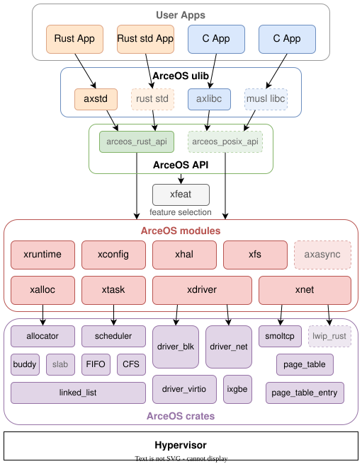

## StarryX 架构设计

本章节介绍 StarryX 从 ArceOS 演进出的组件化宏内核架构。

当前实现划分为三个部分：

1. XCore：由 ArceOS 裁剪并演进出的底层组件集，提供硬件抽象、内存、任务、驱动、文件系统和网络等基础机制。
2. XModules：StarryX 自有 `x*` 组件的扁平集合。它既包含错误、I/O、调度和 VFS 等基础契约，也包含用户空间访问、进程关系、信号、页缓存和文件映射等较高层内核机制。
3. XKernel：拥有宏内核状态和 Linux ABI。`fs`、`mm`、`task`、`ipc`、`net`、`sys` 等模块实现内核服务；`syscall` 子模块负责系统调用解码、参数转换和 trap 回调。系统调用只能依赖内核服务，内核服务不能反向依赖 `syscall`。

```text
user ABI -> xkernel::syscall -> xkernel services -> xmodules / xcore
```

## XCore 来源与边界



XCore 仅保留由 ArceOS modules 裁剪并演进出的底层组件。StarryX 自有的可复用 `x*` 组件位于 `xmodules/`；更底层、命名中立的通用库位于 `crates/`；驱动接口与实现位于 `drivers/`。`xmodules/` 是归属边界而非单一内核层级。当前 `xcore/` 仍不等同于已经完成收缩和安全审计的最小可信核心；后续重构需要进一步明确可信边界、依赖方向和 `unsafe` 所有权。
