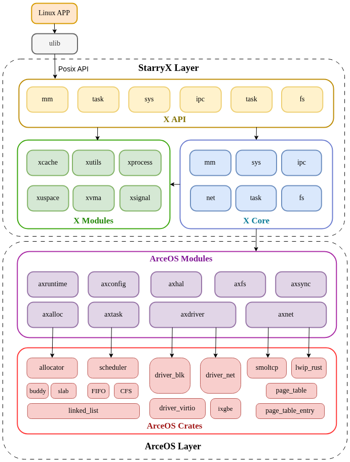

## StarryX 架构设计

本章节将介绍StarryX的架构设计和具体实现，以及其作为ArceOS宏内核扩展应用的理念设计。

我们将StarryX的实现划分为三大部分：

1. Starry Core：关于宏内核的核心逻辑实现。在这里我们定义了用户程序加载、进程管理、地址空间管理等一系列功能，并实现了宏内核的初始化逻辑。它与上层实现的接口（POSIX 接口或其他接口）无关，仅负责完成一个基本的宏内核应当具备的功能：特权级切换、进程粒度的资源隔离等。
2. Starry API：关于POSIX API的核心逻辑实现。我们将API划分为syscall，backend和utils三个模块，其中syscall模块封装了标准的POSIX接口，backend模块调用外部组件为syscall的实现提供数据结构的抽象和具体实现的支持，utils模块调用外部模块并封装给beckend和syscall复用，从而保证了模块的层次清晰
3. Starry Modules：支持宏内核实现POSIX接口的关键组件。与ArceOS的组件化开发原则一致，我们希望Starry中实现的功能可以被其他内核架构复用，我们将他们抽象为各个组件并与具体内核功能解耦。他们与ArceOS Modules共同支撑了Core与API的实现

## ArceOS架构分析

本章将描述基座代码ArceOS 的整体架构和设计理念，介绍其作为组件化操作系统的特殊内核形态，以及如何基于其高度灵活性和可扩展性实现宏内核扩展。
