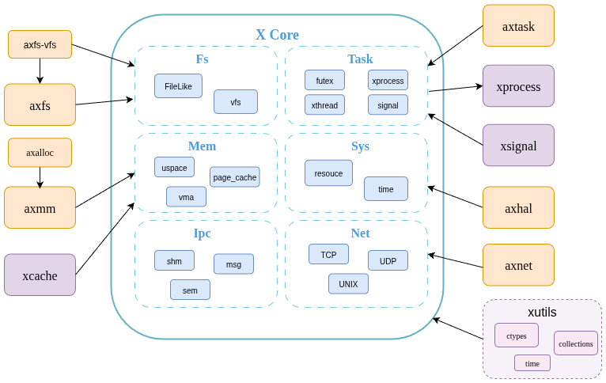

# xcore: 操作系统的核心

`xcore` 是 `StarryX` 操作系统的核心模块。作为基于 `arceos/starry` 的宏内核，`StarryX` 依赖 `xcore` 为整个系统提供基础服务和抽象层。

这包括但不限于：

*   **内存管理：** 处理系统的虚拟内存和物理内存。
*   **任务管理：** 创建、调度和管理任务（进程和线程）。
*   **IPC（进程间通信）：** 为进程之间的通信提供机制。
*   **系统调用接口：** 处理来自用户空间应用程序的系统调用的层。
*   **文件系统抽象：** 为不同的文件系统提供统一的接口。

`xcore` 模块位于 `xcore/` 目录中，是 `StarryX` 架构的基础部分。

## 核心组件

`xcore` 包含几个关键的子模块，它们共同构成了操作系统的核心功能：

*   **`fs` (文件系统):** 提供文件系统抽象和虚拟文件系统 (VFS) 支持。
*   **`ipc` (进程间通信):** 实现消息队列、信号量和共享内存等 IPC 机制。
*   **`mm` (内存管理):** 管理虚拟内存、物理内存和页缓存。
*   **`net` (网络):** 提供网络协议栈和套接字 API。
*   **`sys` (系统):** 包含系统级功能，如资源管理和时间。
*   **`task` (任务管理):** 负责进程和线程的创建、调度和信号处理。

