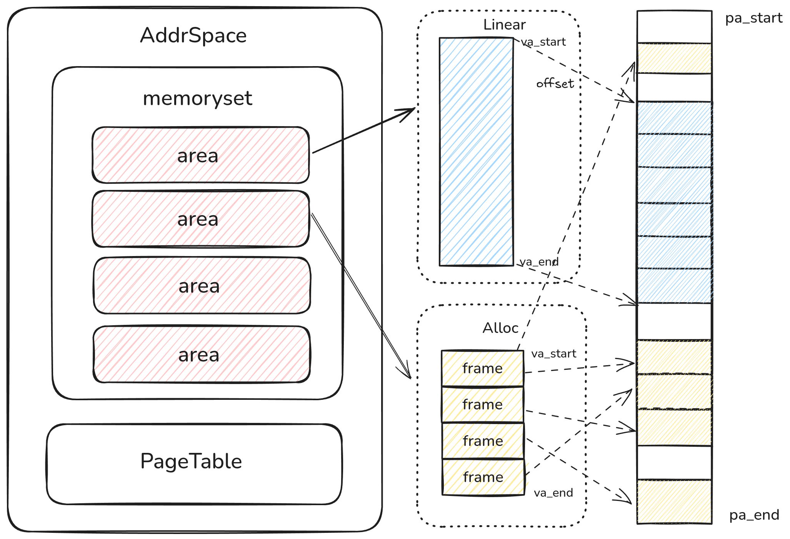

# XMM 内存管理

XMM 是 StarryX 操作系统的核心内存管理器。它负责物理内存和虚拟内存的分配、回收和管理，为系统和应用程序提供高效、可靠的内存支持。

## 主要特性

- **分层设计**：XMM 采用分层结构，将内存管理功能模块化，易于扩展和维护。
- **伙伴系统**：物理内存管理采用伙伴系统算法，有效减少外部碎片。
- **SLAB 分配器**：内核小对象分配使用 SLAB 分配器，提高了小内存分配的效率和性能。
- **按需分页**：支持按需分页的虚拟内存管理，实现了高效的内存使用和快速的进程创建。
- **写时复制 (Copy-on-Write)**：在 `fork` 等操作中利用 COW 技术，减少不必要的内存拷贝，提升系统性能。

## 核心组件

### 1. 物理内存管理器 (PMM)

- **功能**：管理系统的所有物理内存页。
- **实现**：基于伙伴系统，能够快速地分配和回收连续的物理页块。

### 2. 虚拟内存管理器 (VMM)

- **功能**：为每个进程管理独立的虚拟地址空间。
- **实现**：通过页表机制将虚拟地址映射到物理地址，支持内存区域（VMA）的管理。

### 3. SLAB 分配器

- **功能**：为内核中频繁分配和释放的小尺寸数据结构提供高效的缓存机制。
- **实现**：通过对象缓存池减少了初始化和销毁对象的开销。

## API 和使用

XMM 为内核其他模块提供了清晰的 API，用于申请和释放内存。

- `alloc_pages(order)`: 分配 2^order 个连续的物理页。
- `free_pages(page, order)`: 释放指定的物理页。
- `kmalloc(size)`: 从 SLAB 分配器申请内核内存。
- `kfree(ptr)`: 释放 `kmalloc` 分配的内存。
