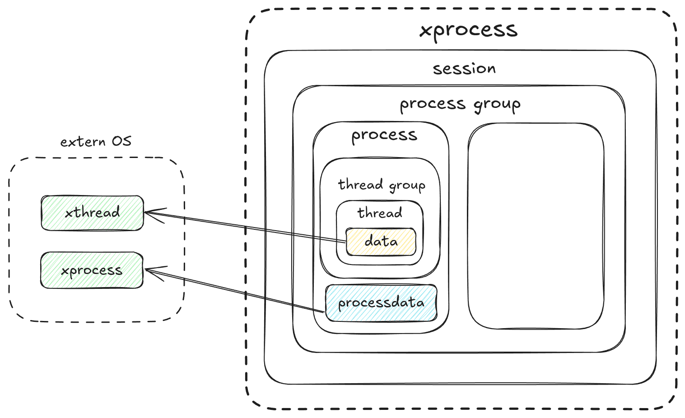

# 组件化与模块解耦

arceos的设计强调组件化与模块化，StarryX在设计时也希望遵从这一设计理念，将部分宏内核功能抽象为可供复用的独立组件，同时避免引入模块依赖，降低模块耦合度，提升系统的可维护性和可扩展性。

我们主要引入了以下宏内核相关组件：用户地址访问`xuspace`，内存映射管理`xvma`，页缓存模块`xcache`，信号系统`xsignal`，进程管理`xprocess`，宏内核工具组件`xutils`、宏内核应用测试套件`xtest`。

## 用户地址访问

`xuspace`组件是StarryX中负责用户地址空间访问的核心模块，它为内核提供了安全、统一的用户空间内存访问接口，其封装了用户态地址访问的复杂性，确保内核在访问用户空间数据时的安全性和正确性。

在设计之初，`xuspace`与`xcore`和`xapi`紧密耦合，由于初期时内存相关机制尚未实现，解耦于StarryX的组件（比如xsignal）可以将用户指针转化为裸指针进行访问，但是这样的访问存在许多问题：

- 无法判断其合法性，无法安全访问用户地址
- 引入了大量对裸指针的unsafe操作
- 实现cow后可能导致在内核态发生缺页异常而发生致命错误

当实现内存延迟分配机制后，解耦于xcore的组件无法再正常访问用户地址空间，因此我们将`xuspace`从`xcore`中解耦成为一个独立组件，并提供抽象接口使其可以被其他系统所复用。


在这个组件中，我们设计了两种指针类型`UserPtr`以及`UserConstPtr`分别对应用户传入的普通指针和`const`指针：

```rust
// 普通指针
pub struct UserPtr<T>(*mut T);
// const指针
pub struct UserConstPtr<T>(*const T);
```

针对其具体功能我们设计了`readable`trait抽象两种指针的行为，再为普通指针实现`writeable`trait

```rust
// readable trait
pub trait Readable {
    /// Get a reference to data in user space
    fn get_as_ref(self, uspace: &A)...
    /// Get a slice from user space
    fn get_as_slice(self, uspace: &A, len: usize)...
    /// Get a null-terminated slice from user space
    fn get_as_null_terminated(self, uspace: &A)...
}

// writeable trait
pub trait Writeable {
    /// Get mutable reference to data in user space
    pub fn get_as_mut(self, uspace: &A)...
    /// Get mutable slice from user space
    pub fn get_as_mut_slice(self, uspace: &A,len: usize)...
    /// Get a mutable null-terminated slice from user space
    pub fn get_as_mut_null_terminated(self, uspace: &A)...
}
```

另外需要实现对于用户空间安全访问的接口，这里接口需要实现：

- 维护用户空间与内核空间的严格边界，防止非法访问
- 提供安全的用户数据读取与写入接口
- 分配内存页避免发生页错误

这里的接口实现依赖于宏内核具体的虚拟地址空间管理方法，因此我们抽象了`UserSpaceAccess`trait，其暴露两个接口让内核实现用户内存访问的合法性检查，`UserSpaceAccess`的剩下接口提供默认的内存访问方法给实现了该trait的`uspace`，这些方法封装了`UserPtr`操作并调用内核实现的接口实现安全检查从而避免了直接操作`UserPtr`。

```rust
pub trait UserSpaceAccess: Sized {
    /// check accessible
	fn check_region_access(&self, range: VirtAddrRange, access_flags: MappingFlags)...
	/// Populate a memory region making it accessible
	fn populate_region(&self, range: VirtAddrRange, access_flags: MappingFlags)...
	/// Read a value from user space
    fn read<P, T>(&self, ptr: P) -> LinuxResult<T>
    where
        P: UserReadable<T>,
        T: Copy + 'static,
    {
        ptr.get_as_ref(self).copied()
    }
    
    fn write...
    fn read_slice...
}
```

其他OS只要实现`UserAccessTrait`中的两个用户内存地址检查接口就可以复用相关API实现用户地址空间访问。

## 进程管理

`xprocess`是实现StarryX进程管理的核心组件，它提供了完整的进程生命周期管理、进程间关系维护以及线程组织功能。它实现了数据管理与生命周期的管理的分离，将POSIX标准下的进程间关系由组件进行维护，而进程和线程的相关内部数据提供接口交由具体的OS实现，具有良好的灵活性和可扩展性。



其内部具体实现了基本的进程管理组织：

```rust
/// 线程
pub struct Thread {
    tid: ...        // 线程id
    process: ...    // 所属进程
    data: ...       // 线程数据
}

/// 线程组
pub struct ThreadGroup {
    threads：...     // 线程集合
    exit_code: ...   // 退出码
    group_exited: ...// 是否退出
}

/// 进程
pub struct Process {
    pid: ...        // 进程id
    is_zombie: ...  // 僵尸进程
    tg: ...         // 线程组
    data: ...       // 进程数据接口
    children: ...   // 子进程
    parent: ...     // 父进程
    group: ...      // 进程组
}

/// 进程组
pub struct ProcessGroup {
    pgid: ...       // 进程组id
    session: ...    // 会话 
    processes: ...  // 进程集合
}

/// 会话
pub struct Session {
    sid: ...            // 会话id
    process_groups: ... // 所属进程组
}
```

这些数据结构实现了基本的进程层次管理与基本功能，在这基础上我们提供了进程创建退出等api让OS灵活地进行生命周期的维护：

```rust
/// 进程构建器
pub struct ProcessBuilder {
    data<T>(data: T) -> Self        // 设置进程数据
    build() -> Arc<Process>         // 构建进程实例
}

/// 进程创建
impl Process {
    new_init(pid: Pid) -> ProcessBuilder    // 创建init进程
    fork(pid: Pid) -> ProcessBuilder        // 创建子进程
}

/// 进程状态控制
impl Process {
    exit(self: &Arc<Self>)                  // 进程退出，转为僵尸状态
    group_exit(&self)                       // 标记整个线程组退出
    free(&self)                             // 释放僵尸进程资源
}

/// 线程构建器等...
```

经过对进程层次管理和生命周期管理的实现，`xprocess`为宏内核提供了稳定可靠的进程抽象和管理能力，同时保持了良好的可扩展性和可维护性。

## 页缓存

`xcache`组件是StarryX中实现页面缓存管理的核心模块，基于LRU算法提供高效的文件页面缓存服务。该组件通过缓存文件数据页面，减少磁盘I/O操作，显著提升文件系统的访问性能（iozone测例分数上升近50%），同时提供完整的脏页管理和数据同步机制。在组件化OS中实现页缓存需要面对以下挑战

- 涉及多个模块，包括文件系统、内存管理和进程管理
- 原本独立的模块引入依赖，耦合度高（如文件系统引入内存管理依赖）
- 上层无法对缓存直接控制，回收困难

为了降低模块耦合度，保证底层arceos的`axfs`和`axmm`的独立性，我们将`PageCache`的实现抽象为一个独立组件，解除了多个模块的依赖关系，同时其不依赖特定的文件系统和内存管理系统实现，可以为不同类型的文件系统提供统一的缓存服务。


`xcache`维护了一个PageCache数据结构，其与文件系统的inode相对应（类似于Linux inode与addr_space设计），其内部的LRUCache通过HashMap实现快速查找缓存页，同时基于LRU算法管理缓存页；PageCache通过trait实现泛型抽象设计，将页缓存底层操作抽象为文件系统相关的读写操作和内存管理相关的页面分配及操作：

```rust
// 页缓存结构
pub struct PageCache<N: InodeOps, P: PageOps> {
    pub host: N,                               // 文件操作接口
    pages: Mutex<LruCache<u64, CachePage>>,    // 缓存页集合（key为偏移量）
    file_size: AtomicU64,                      // 文件大小
    _marker: core::marker::PhantomData<P>,     // 页面操作接口
}

// 缓存页
pub struct CachePage {
    pub addr: PhysAddr,    // 页物理地址
    pub state: PageState,  // 页面状态
}
```

与文件系统相关的操作为缓存未命中时对底层磁盘的读写操作：

```rust
/// 文件节点操作接口
pub trait InodeOps {
    fn read_at(&self, buf: &mut [u8], offset: u64) -> LinuxResult<usize>;
    fn write_at(&self, buf: &[u8], offset: u64) -> LinuxResult<usize>;
}
```

与内存管理相关的操作为缓存未命中时的物理页分配操作和命中时的读写操作：

```rust
/// 页面操作接口
pub trait PageOps {
    fn alloc_page() -> Option<PhysAddr>;
    fn dealloc_page(addr: PhysAddr);
    fn read_page(addr: VirtAddr, buf: &mut [u8]) -> LinuxResult;
    fn write_page(addr: VirtAddr, buf: &[u8]) -> LinuxResult;
}
```

在实现上述接口后，OS即可实现自己的PageCache管理器。

PageCache内部实现了完整的页面加载、写入操作、同步会写流程（UpToDate->Dirty->WriteBack->ToWrite），保证了页面缓存的数据数据一致性、操作安全性和性能优化：

```rust
pub enum PageState {
    UpToDate,          // 干净页面
    Dirty,             // 脏页
    WriteBack,         // 待回写 （提供一致性快照，确保同步操作的原子性）
    ToWrite,           // 写回中 （提供I/O并发控制，防止重复回写）
}
```

PageCache也提供了灵活的页面回收机制，包括局部回收，全局回收以及LRU回收，可以灵活应用于各个场景

```rust
impl PageCache {
    pub fn evict() ...          // 全局回收
    pub fn evict_range() ...    // 回收指定范围
    pub fn evict_from_pos() ... // 从指定位置回收(ftruncate)
    pub fn evict_lru() ...      // 使用LRU算法回收
}
```

通过`xcache`组件，StarryX实现了高效且可靠的页面缓存系统，为文件系统提供了重要的性能优化基础设施，同时保持了良好的模块化设计和扩展性。

`xcahce`目前仅实现了Buffered IO，没有实现对于进程管理相关的抽象（mmap通过map_shared分配），这是我们未来进一步的改进和开发方向。

## 内存映射管理

`xvma`组件是StarryX中专门处理文件支持的虚拟内存区域(mmap分配)管理模块，它实现了高效的按需加载内存映射机制。该组件专注于文件映射场景，提供精确的地址范围管理和智能的页面加载策略。

在原本arceos的内存管理设计中axmm模块已经实现了地址空间`memory_set`的管理，POSIX标准下mmap映射文件会引入虚拟内存区域与文件相关联的操作，这与页缓存一样会使基座OS独立的模块引入依赖，在与arceos的开发者交流后，我们选择将这一层功能放在宏内核实现，避免引入依赖，保持模块的低耦合。

在组件内部我们实现了文件映射区域的有效管理，并且未来可以扩展到对所有mmap区域进行管理，与PageCache等组件配合工作完整实现mmap的所有功能：

```rust
/// 文件支持的内存映射区域
pub struct MmapRegion<F: VmFile> {
    pub range: VirtAddrRange,                    // 虚拟地址范围
    pub file: F,                                 // 支持的文件对象
    pub offset: isize,                           // 文件偏移量
    pub populated: Mutex<BTreeSet<VirtAddr>>,    // 已加载页面集合
    pub align: PageSize,                         // 页面对齐大小
}

/// 虚拟内存区域管理器
pub struct VmaManager<F: VmFile> {
    regions: Vec<MmapRegion<F>>,                 // 内存映射区域集合
}
```

mmap系统调用会对映射的文件页和内存区域在`VmaManager`注册虚拟内存区域，并对虚拟内存区域进行管理，完成精确的地址范围管理以及区域分割与合并，保持页面加载状态的一致性，并实现高效的地址查找和范围操作：

```rust
impl<F: VmFile> VmaManager<F> {
    add_region()...             // 添加映射区域
    find_region()...            // 查找包含地址的区域
    remove_overlapped()...      // 移除重叠区
    split_at_range()...         // 区域分割
}
```

通过`xvma`StarryX实现了文件页的延迟加载策略，支持文件数据的按需读取和缓存，支持文件数据的按需读取和缓存；在发生缺页异常时，内核会先对发生缺页异常的地址进行快速区域查找，找到则读取文件数据，未找到则再交付给底层axmm执行缺页异常处理，实现了高效的文件页懒分配机制。

目前`xvma`主要支持了mmap的文件页映射管理，未来我们希望扩展xvma更多功能，使其可以成为一个高效独立管理mmap区域的组件，通过该组件减少进程管理、内存管理和文件系统间复杂的内核耦合关系。

## 信号系统

`xsignal`组件是StarryX中负责信号处理和管理的核心模块，它为内核提供了完整的UNIX风格信号处理机制。该模块实现了标准信号和实时信号的管理、信号动作配置、信号挂起队列管理以及跨平台的信号处理支持。

在传统的宏内核设计中，信号处理通常与进程管理、内存管理等子系统紧密耦合，这使得信号系统难以独立测试和维护。在StarryX的组件化设计中，我们将信号处理抽象为独立的`xsignal`组件，通过trait抽象解除与其他子系统的依赖关系，使其可以被不同的操作系统实现复用。在组件化OS中实现信号系统需要面对以下挑战：

- 多模块依赖: 信号处理涉及进程管理、线程管理、用户空间访问等多个模块
- 平台相关性: 不同架构下信号处理的细节存在差异

为了解决这些挑战，我们将`xsignal`设计为一个高度模块化的组件，通过trait抽象隐藏底层实现细节，同时保证信号处理的正确性和高效性。

在这个组件中，我们设计了核心的信号类型和管理结构：

```rust
// 信号类型
pub enum Signo { SIGHUP = 1, SIGINT = 2, ... SIGRT32 = 64 }
pub struct SignalSet(u64);
pub struct SignalInfo(pub siginfo_t);

// 信号动作
pub struct SignalAction {
    pub flags: SignalActionFlags,
    pub mask: SignalSet,
    pub disposition: SignalDisposition,
    pub restorer: __sigrestore_t,
}

// 挂起信号管理
pub struct PendingSignals {
    pub set: SignalSet,
    info_std: [Option<SignalInfo>; 32],      // 标准信号合并
    info_rt: [VecDeque<SignalInfo>; 33],     // 实时信号队列
}
```

针对其具体功能我们设计了`WaitQueue`trait抽象线程等待行为，再通过复用`xuspace`的`UserSpaceAccess`trait实现安全的用户空间访问

```rust
// 线程等待抽象
pub trait WaitQueue: Default {
    fn wait_timeout(&self, timeout: Option<Duration>) -> bool;
    fn wait(&self);
    fn notify_one(&self) -> bool;
    fn notify_all(&self);
}

// 信号处理函数中安全访问用户空间
fn handle_signal<A: UserSpaceAccess>(
    &self,
    uspace: &A,
    tf: &mut TrapFrame,
    // ...
) -> Option<SignalOSAction>
```

另外需要实现对于信号处理的接口，这里接口需要实现：

- 维护进程级和线程级的信号状态管理
- 提供安全的信号投递与处理接口
- 支持标准信号合并和实时信号队列

这里的接口实现依赖于宏内核具体的进程管理和线程调度方法，因此我们抽象了双层管理架构，其暴露接口让内核实现信号处理的状态管理，其余接口提供默认的信号处理方法给实现了该trait的管理器，这些方法封装了信号操作并调用内核实现的接口实现状态同步从而避免了直接操作底层数据。

```rust
/// 进程级信号管理器
pub struct ProcessSignalManager<M, WQ> {
    pending: Mutex<M, PendingSignals>,
    pub actions: Arc<Mutex<M, SignalActions>>,
    pub(crate) wq: WQ,
    pub(crate) default_restorer: usize,
}

/// 线程级信号管理器  
pub struct ThreadSignalManager<M, WQ> {
    proc: Arc<ProcessSignalManager<M, WQ>>,
    pending: Mutex<M, PendingSignals>,
    blocked: Mutex<M, SignalSet>,
    stack: Mutex<M, SignalStack>,
}
```

经过对双层信号管理和生命周期管理的实现，`xsignal`为宏内核提供了稳定可靠的信号抽象和处理能力，同时保持了良好的可扩展性和可维护性。

其他OS只要实现`WaitQueue`抽象接口就可以复用相关API实现信号处理。

```rust
impl WaitQueue for MyWaitQueue {
    fn wait_timeout(&self, timeout: Option<Duration>) -> bool { ... }
    fn notify_one(&self) -> bool { ... }
    // ... 其他方法
}

// 使用xsignal组件
let proc_mgr = ProcessSignalManager::<MyMutex, MyWaitQueue>::new(...);
let thread_mgr = ThreadSignalManager::new(Arc::new(proc_mgr));
```

通过`xsignal`组件，StarryX实现了高效且可扩展的信号处理系统，为宏内核提供了完整的UNIX信号语义支持，同时保持了良好的模块化设计和跨平台兼容性。
