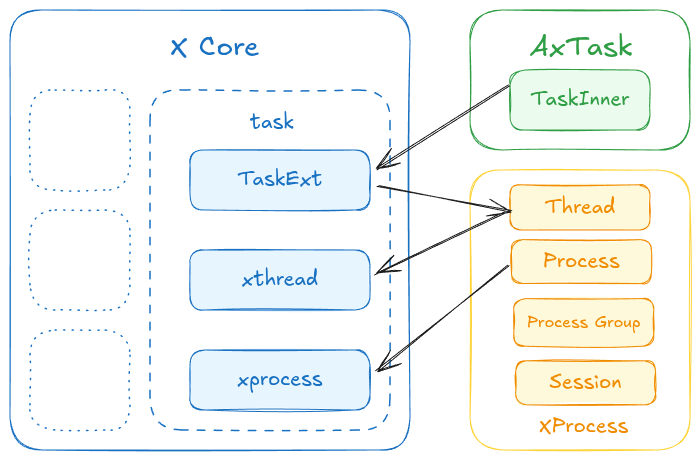

# xproc: 进程管理

`xproc` 是 `StarryX` 中的进程管理模块。它负责创建、管理和调度进程。该模块是操作系统的关键部分，支持多任务处理和程序的隔离执行。

`xproc` 的主要功能包括：

*   **进程创建：** `xproc` 处理 `fork` 和 `exec` 系统调用，允许创建新进程。
*   **进程生命周期：** 它管理进程的整个生命周期，从创建到终止。
*   **调度：** `xproc` 中的调度器决定在任何给定时间运行哪个进程，确保CPU的公平和高效使用。
*   **信号处理：** `xproc` 实现信号处理机制，允许进程响应异步事件。

`xproc` 模块位于 `xmodules/xprocess` 目录中。

## 关键组件

`xproc` 模块由以下几个关键组件构成：

*   **`process.rs`:** 定义了进程控制块 (PCB) 和与进程相关的操作。
*   **`thread.rs`:** 定义了线程控制块 (TCB) 和线程管理。
*   **`process_group.rs`:** 管理进程组，用于信号分发等。
*   **`session.rs`:** 管理会话，用于作业控制。

