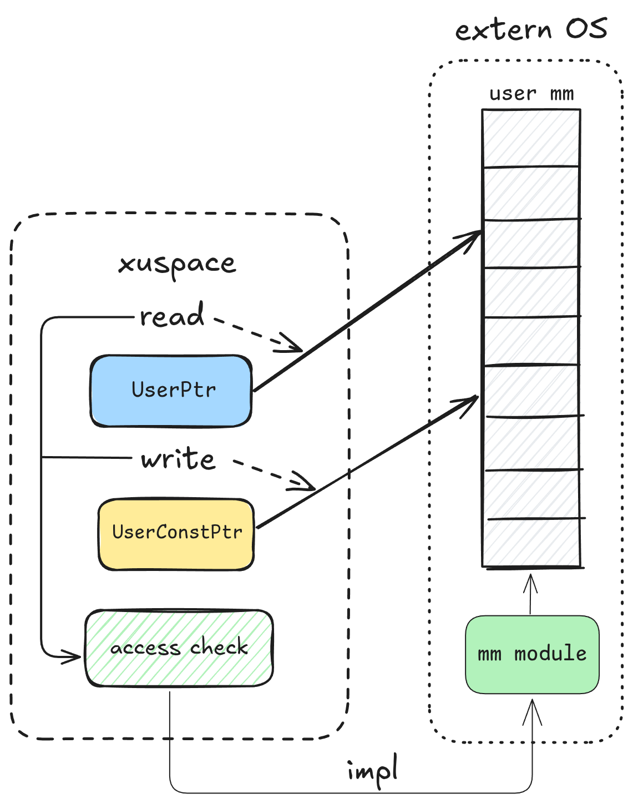

## 用户地址访问

`xuspace`组件是StarryX中负责用户地址空间访问的核心模块，它为内核提供了安全、统一的用户空间内存访问接口，其封装了用户态地址访问的复杂性，确保内核在访问用户空间数据时的安全性和正确性。

在设计之初，`xuspace`与`xcore`和`xapi`紧密耦合，由于初期时内存相关机制尚未实现，解耦于StarryX的组件（比如xsignal）可以将用户指针转化为裸指针进行访问，但是这样的访问存在许多问题：

- 无法判断其合法性，无法安全访问用户地址
- 引入了大量对裸指针的unsafe操作
- 实现cow后可能导致在内核态发生缺页异常而发生致命错误

当实现内存延迟分配机制后，解耦于xcore的组件无法再正常访问用户地址空间，因此我们将`xuspace`从`xcore`中解耦成为一个独立组件，并提供抽象接口使其可以被其他系统所复用。



在这个组件中，我们设计了两种指针类型`UserPtr`以及`UserConstPtr`分别对应用户传入的普通指针和`const`指针：

```rust
// basic ptr
pub struct UserPtr<T>(*mut T);
// const ptr
pub struct UserConstPtr<T>(*const T);
```

针对其具体功能我们设计了`readable`trait抽象两种指针的行为，再为普通指针实现`writeable`trait

```rust
// readable trait
pub trait Readable<T> {
    /// Get a reference to data in user space
    fn get_as_ref<A: UserSpaceAccess>(self, uspace: &A) -> LinuxResult<&'static T>;
    /// Get a slice from user space
    fn get_as_slice<A: UserSpaceAccess>(self, uspace: &A, len: usize) -> LinuxResult<&'static [T]>;
    /// Get a null-terminated slice from user space
    fn get_as_null_terminated<A: UserSpaceAccess>(self, uspace: &A) -> LinuxResult<&'static [T]>
    where
        T: PartialEq + Default;
}

// writeable trait
pub trait Writeable<T> {
    /// Get mutable reference to data in user space
    pub fn get_as_mut<A: UserSpaceAccess>(self, uspace: &A) -> LinuxResult<&'static mut T>；
    /// Get mutable slice from user space
    pub fn get_as_mut_slice<A: UserSpaceAccess>(self, uspace: &A,len: usize) -> LinuxResult<&'static mut [T]>；
    /// Get a mutable null-terminated slice from user space
    pub fn get_as_mut_null_terminated<A: UserSpaceAccess>(self, uspace: &A) -> LinuxResult<&'static mut [T]>
    where
        T: PartialEq + Default；
}
```

另外需要实现对于用户空间安全访问的接口，这里接口需要实现：

- 维护用户空间与内核空间的严格边界，防止非法访问
- 提供安全的用户数据读取与写入接口
- 分配内存页避免发生页错误

这里的接口实现依赖于宏内核具体的虚拟地址空间管理方法，因此我们抽象了`UserSpaceAccess`trait，其暴露两个接口让内核实现用户内存访问的合法性检查，`UserSpaceAccess`的剩下接口提供默认的内存访问方法给实现了该trait的`uspace`，这些方法封装了`UserPtr`操作并调用内核实现的接口实现安全检查从而避免了直接操作`UserPtr`。

```rust
pub trait UserSpaceAccess: Sized {
    /// check accessible
	fn check_region_access(&self, range: VirtAddrRange, access_flags: MappingFlags) -> LinuxResult<()>;
	/// Populate a memory region making it accessible
	fn populate_region(&self, range: VirtAddrRange, access_flags: MappingFlags) -> LinuxResult<()>;
	/// Read a value from user space
    fn read<P, T>(&self, ptr: P) -> LinuxResult<T>
    where
        P: UserReadable<T>,
        T: Copy + 'static,
    {
        ptr.get_as_ref(self).copied()
    }

    fn write...
    fn read_slice...
}
```

其他OS只要实现`UserAccessTrait`中的两个用户内存地址检查接口就可以复用相关API实现用户地址空间访问。