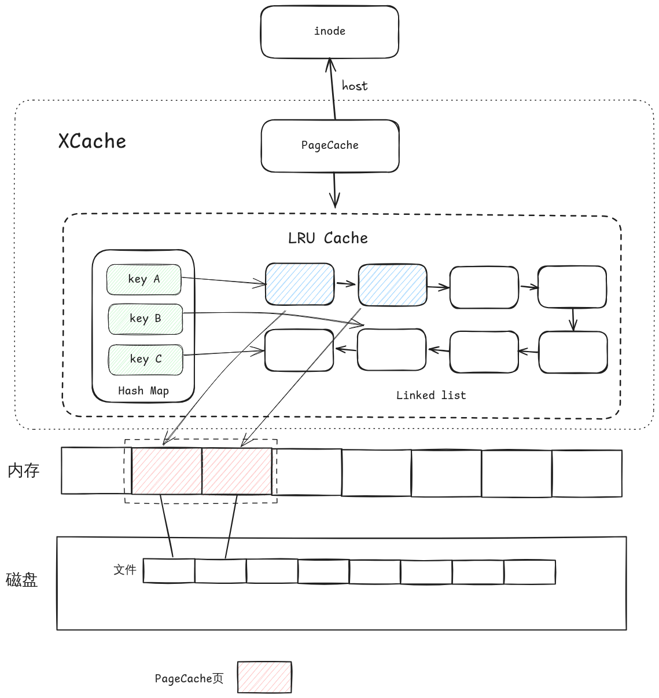

# 页缓存

页缓存是 `StarryX` 操作系统使用的一种机制，通过在内存中存储文件数据的副本来减少磁盘 I/O。当从磁盘读取文件时，数据会存储在页缓存中。如果再次需要相同的数据，可以快速从缓存中检索，而不是再次从磁盘读取，这要慢得多。

## 关键概念

*   **缓存：** 页缓存存储来自磁盘文件的数据页。这对应用程序是透明的。
*   **回写/直写：** 页缓存可以使用不同的策略将数据写回磁盘。回写缓存延迟写入磁盘，可以提高性能，而直写缓存立即写入磁盘。
*   **驱逐：** 当缓存已满时，操作系统需要决定将哪些页从缓存中驱逐（移除）以为新数据腾出空间。常见的算法包括 LRU（最近最少使用）。

`StarryX` 中的页缓存实现位于 `xmodules/xcache` 目录中。它在文件系统的整体性能中发挥着关键作用。

## 实现细节

`StarryX` 的页缓存实现是通用的，它通过 `InodeOps` 和 `PageOps` trait 与底层的文件系统和内存管理模块进行交互。

*   **`PageCache` 结构体:** 这是页缓存的核心结构，它包含一个 `LruCache` 来存储缓存的页面。
*   **`InodeOps` trait:** 定义了与 inode 交互的接口，如 `read_at` 和 `write_at`。
*   **`PageOps` trait:** 定义了与页面相关的操作，如 `alloc_page` 和 `dealloc_page`。
*   **页面状态:** 每个缓存的页面都有一个状态（`UpToDate`, `Dirty`, `WriteBack`, `ToWrite`），用于跟踪其内容是否与磁盘同步。
*   **LRU 驱逐策略:** 当缓存已满时，使用 LRU（最近最少使用）算法来选择要驱逐的页面。

